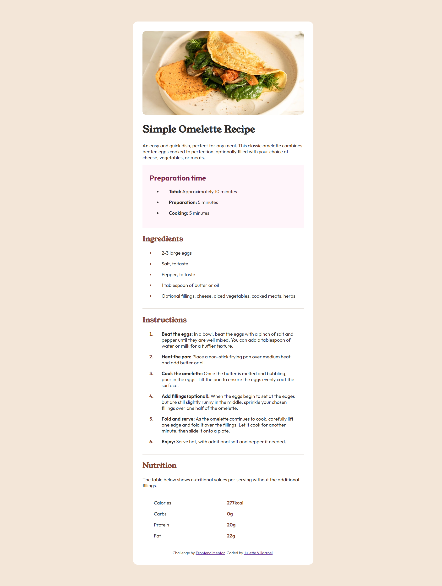

# Frontend Mentor - Recipe page solution

This is a solution to the [Recipe page challenge on Frontend Mentor](https://www.frontendmentor.io/challenges/recipe-page-KiTsR8QQKm). Frontend Mentor challenges help you improve your coding skills by building realistic projects. 

## Table of contents

- [Overview](#overview)
  - [The challenge](#the-challenge)
  - [Screenshot](#screenshot)
  - [Links](#links)
  - [Built with](#built-with)
  - [What I learned](#what-i-learned)
  - [Continued development](#continued-development)
  - [Useful resources](#useful-resources)
- [Author](#author)
- [Acknowledgments](#acknowledgments)


## Overview

This is my first challenge on frontend mentor's website and I'm very excited to share it! You'll find more of these challenges in my profile. I'm starting to really understand CSS and I'll share my learning journey as well. Here I mention all the things that helped me to complete it, some recommendations and things that made me proud. Keep reading!

## The Challenge

"This challenge will help you focus on writing semantic HTML. Ensure you think through what HTML elements are most appropriate for each piece of content."
The goal this time was to practice semantic HTML and my basic knowledge of CSS.

### Screenshot



This is a screenshot of my solution.

**Note: Delete this note and the paragraphs above when you add your screenshot. If you prefer not to add a screenshot, feel free to remove this entire section.**

### Links

- Solution URL: [Add solution URL here](https://github.com/juliettedb-v/recipe-page-main)
- Live Site URL: [Add live site URL here](https://juliettedb-v.github.io/recipe-page-main/)


### Built with

- Semantic HTML5 markup
- CSS custom properties
- Flexbox
- CSS Grid


### What I learned

I'm really proud of my resposive design solution. Actually I had to repeat this solution because in my first try the responsive was awful I was so confused due desorganization in my code. So when I tried a second time and came up with this results after a couple of minutes I felt relief. There's people saying responsive design is difficult and I kinda get it.

```css
    @media (max-width:640px){    

      body {
        margin:0;
        padding: 0px;
      }

      .container {
        width: 100%;
        height: 100%;
        padding: 0px;
      }

      div {
        padding: 32px;
      }

      .recipe-image {
        padding: 0px;
      }

      .recipe-image img {
        width: 100vw;
        height: 240px;
        border-radius: 0px;
      }

      .preparation,
      .ingredients,
      .instructions,
      .nutrition,
      .attribution,
      hr {
        margin: 0px 32px 0px 32px;
      }
    }

```

### Continued development

I will continue my CSS learning journey for sure, this is just the beginning and I had a lot of fun making this challenge. I'll focus on flexbox and CSS grid now.


### Useful resources

- [Leartheweb](https://learntheweb.courses/topics/flexbox/) - This is an amazing article that helped me to focus on flexbox layout and it cleared some things up for me. Very helpful for starters.


## Author

- Website - [Juliette](https://github.com/juliettedb-v)
- Frontend Mentor - [@juliettedb-v](https://www.frontendmentor.io/profile/juliettedb-v)

## Acknowledgments

Taking Platzi's courses really helped me out to understand basic knowledge that I needed for completing this challenge. I know it's helpful for a lot of hispanics out there and I highly recommend it.

